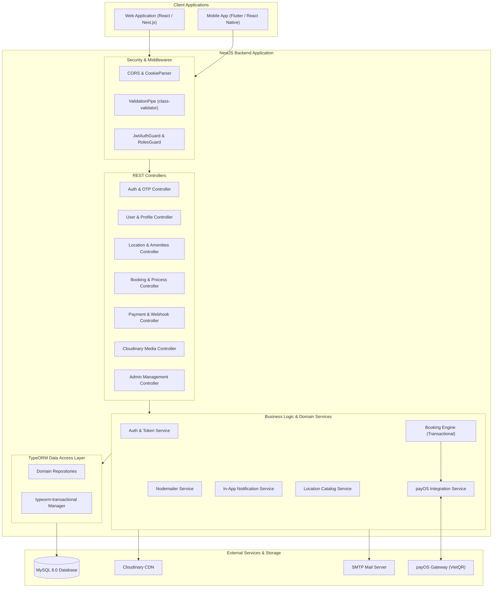

<p align="center">
  <a href="https://nestjs.com/" target="_blank">
    
  </a>
</p>

<h1 align="center">DATN - Travel Stay & Hospitality Reservation API</h1>

<p align="center">
  A production-ready, modular RESTful backend powering a modern travel accommodation, homestay booking, and hospitality hosting platform.
</p>

<p align="center">
  
  
  
  
  
  
  
</p>

---

## 📑 Table of Contents

- [Overview](#-overview)
- [System Architecture](#-system-architecture)
- [Core Features & RBAC](#-core-features--rbac)
- [Tech Stack](#-tech-stack)
- [Project Structure](#-project-structure)
- [Getting Started](#-getting-started)
  - [Prerequisites](#prerequisites)
  - [1. Clone Repository](#1-clone-repository)
  - [2. Install Dependencies](#2-install-dependencies)
  - [3. Configure MySQL Database](#3-configure-mysql-database)
  - [4. Environment Configuration](#4-environment-configuration)
  - [5. Database Migrations & Seeds](#5-database-migrations--seeds)
  - [6. Running the Application](#6-running-the-application)
- [API Documentation (Swagger)](#-api-documentation-swagger)
- [Database Management Scripts](#-database-management-scripts)
- [Academic & Author Credits](#-academic--author-credits)
- [Related Projects](#-related-projects)
- [License](#-license)

---

## 🌟 Overview

**DATN - Travel Stay & Hospitality Reservation API** is a robust backend system designed for comprehensive homestay, villa, and hospitality rental management. Similar to platforms like *Airbnb* and *Booking.com*, the system connects property hosts/owners with travelers, orchestrating high-concurrency room reservations, automated VietQR online payment flows via **payOS**, granular role-based access control, location media curation, and transactional email verification.

### Key Highlights
- **Atomic Booking Transactions**: Safe concurrency handling with `typeorm-transactional` ensuring room dates cannot be double-booked.
- **VietQR Payment Automation**: Integrated with **payOS** for checkout QR generation and secure webhook signature verification.
- **Enterprise-Grade Security**: Dual-token architecture (Access & Refresh JWT), stateful **Token Blacklisting** for instant revocation on logout, and bcrypt password hashing.
- **Scalable Media Pipelines**: Multi-asset upload and transformation via **Cloudinary**.
- **Decoupled Architecture**: Domain-driven modular design using NestJS modules, custom repositories, and asynchronous event processing (`@nestjs/event-emitter`).

---

## 🏗 System Architecture

The backend operates as a structured modular service communicating with persistence layers, payment gateways, cloud media storage, and client applications.



---

## 🛡 Core Features & RBAC

The system enforces a strict **Role-Based Access Control (RBAC)** model with three specialized user roles:

| Feature / Domain | Customer (Guest) | Owner (Host) | Administrator |
| :--- | :---: | :---: | :---: |
| **User Authentication & Profile** | ✅ | ✅ | ✅ |
| **Email Verification & OTP Reset** | ✅ | ✅ | ✅ |
| **Search & View Accommodations** | ✅ | ✅ | ✅ |
| **Manage Favorites & Reviews** | ✅ | ❌ | ✅ |
| **Book Accommodations** | ✅ | ❌ | ❌ |
| **Pay with payOS (VietQR)** | ✅ | ❌ | ❌ |
| **Request Booking Cancellation / Refund**| ✅ | ❌ | ❌ |
| **Register & Manage Properties** | ❌ | ✅ | ✅ |
| **Property Availability & Price Calendar**| ❌ | ✅ | ✅ |
| **Upload Media & Location Amenities** | ❌ | ✅ | ✅ |
| **Manage Received Bookings** | ❌ | ✅ | ✅ |
| **Review & Approve Properties** | ❌ | ❌ | ✅ |
| **Platform Revenue & System Auditing** | ❌ | ❌ | ✅ |
| **Manage Users & Role Assignments** | ❌ | ❌ | ✅ |

### Domain Breakdown
1. **Authentication & Session Management**:
   - Register, login, refresh token rotation, and secure logout.
   - Centralized `token_blacklist` table ensures invalidated tokens cannot be reused.
   - OTP codes generated with TTL (Time-to-live) and dispatched via HTML email templates.
2. **Location & Accommodation Management**:
   - Comprehensive metadata: address coordinates (latitude/longitude), room types, rules, check-in/out policies.
   - Amenities catalog (WiFi, pool, BBQ, kitchen, parking, air conditioning).
   - High-performance availability calendar checks.
3. **Booking Engine**:
   - Multi-step booking lifecycle: `PENDING` ➔ `CONFIRMED` ➔ `CHECKED_IN` ➔ `COMPLETED` / `CANCELLED`.
   - Atomic database locks during reservation creation to eliminate race conditions and overbooking.
4. **Payment & Webhooks**:
   - Integration with **payOS** generating instant VietQR codes and payment URLs.
   - Asynchronous Webhook listener with SHA-256 checksum validation to prevent tampering.
   - Automated status synchronization: marks booking as `CONFIRMED` once bank payment succeeds.
   - Dedicated refund handling workflow (`TBRefundRequest`).
5. **Notifications & Communications**:
   - In-app notification center for booking milestones, payment receipts, and owner alerts.
   - Email dispatching via Nodemailer for OTPs and booking receipts.

---

## 💻 Tech Stack

| Category | Technology | Description |
| :--- | :--- | :--- |
| **Runtime & Core** | [Node.js](https://nodejs.org/) & [NestJS 11](https://nestjs.com/) | Progressive Node.js framework for scalable enterprise backends |
| **Language** | [TypeScript 5.7](https://www.typescriptlang.org/) | Strongly typed JavaScript with modern decorator support |
| **Database** | [MySQL 8.0+](https://www.mysql.com/) | Relational database engine with `utf8mb4` full Unicode support |
| **ORM Layer** | [TypeORM 0.3](https://typeorm.io/) | Data Mapper ORM with custom migrations and scalar relations |
| **Transactions** | [typeorm-transactional](https://github.com/Aliheym/typeorm-transactional) | Decorator-based transactional context management across services |
| **Security & Auth** | [Passport.js](http://www.passportjs.org/) & [JWT](https://jwt.io/) | Stateless access tokens, refresh tokens, and bcrypt password hashing |
| **Validation** | [class-validator](https://github.com/typestack/class-validator) | Declarative DTO validation pipes |
| **Payment Gateway** | [@payos/node](https://payos.vn/) | Automated QR payment checkout and webhook verification |
| **Cloud Storage** | [Cloudinary](https://cloudinary.com/) | Cloud-native media storage, image optimization, and uploads |
| **Email Service** | [Nodemailer](https://nodemailer.com/) | SMTP transport for transactional emails and OTP delivery |
| **Event Bus & Tasks**| `@nestjs/event-emitter`, `@nestjs/schedule` | Event-driven architecture and scheduled cron jobs |
| **API Documentation**| [Swagger / OpenAPI](https://swagger.io/) | Interactive API explorer and auto-generated API specifications |

---

## 📁 Project Structure

```text
be-datn/
├── src/
│   ├── assets/              # Constants, interfaces, and enums
│   ├── common/              # Cross-cutting concerns
│   │   ├── cloudinary/      # Cloudinary provider configuration
│   │   ├── decorators/      # Custom decorators (@Public, @Roles, @CurrentUser)
│   │   ├── guards/          # Role-based and authentication guards
│   │   └── jwt/             # Passport JWT strategy and guard implementation
│   ├── controllers/         # REST API Controllers
│   │   ├── admin/           # Administrative endpoints (Location, Owner management)
│   │   ├── owner/           # Property owner endpoints
│   │   ├── auth.controller.ts
│   │   ├── booking.controller.ts
│   │   ├── bookingProcess.controller.ts
│   │   ├── cloudinary.controller.ts
│   │   ├── location.controller.ts
│   │   ├── notification.controller.ts
│   │   ├── payment.controller.ts
│   │   └── user.controller.ts
│   ├── dtos/                # Data Transfer Objects with validation decorators
│   ├── entities/            # TypeORM Database Entities (BaseEntity with soft-deletes)
│   │   ├── location/        # Location, media, addresses, amenities, types
│   │   ├── user/            # User credentials, roles, profiles
│   │   ├── booking.entity.ts
│   │   ├── payment.entity.ts
│   │   ├── payos-webhook-event.entity.ts
│   │   └── token_blacklist.entity.ts
│   ├── migrations/          # TypeORM schema migrations
│   ├── modules/             # NestJS Feature Modules (Auth, Booking, Payment, etc.)
│   ├── repositories/        # Custom repository layer for decoupled DB queries
│   ├── seed/                # Database seeders (mock accounts, amenities, locations)
│   ├── services/            # Core business logic and external integrations
│   ├── types/               # TypeScript custom types and declarations
│   ├── utils/               # Helper utilities (string formatters, date helpers)
│   ├── app.module.ts        # Root application module
│   ├── data-source.ts       # TypeORM DataSource & CLI configuration
│   ├── main.ts              # Entry point (CORS, Pipes, Swagger initialization)
│   └── swagger.config.ts    # Swagger / OpenAPI documentation configuration
├── .env                     # Local environment file (ignored in git)
├── nest-cli.json            # NestJS CLI configuration
├── package.json             # Project dependencies and script declarations
└── tsconfig.json            # TypeScript compiler configuration & path aliases
```

---

## 🚀 Getting Started

Follow these steps to set up and run the backend locally.

### Prerequisites
- **Node.js**: `v18.x` or `v20.x` installed ([Download Node.js](https://nodejs.org/))
- **npm**: `v9.x` or higher
- **MySQL Server**: `8.0+` installed and running locally

---

### 1. Clone Repository
```bash
git clone https://github.com/cmtan04/DATN_BE.git
cd DATN_BE
```

---

### 2. Install Dependencies
```bash
npm install
```

---

### 3. Configure MySQL Database
Open MySQL Workbench, phpMyAdmin, or your terminal MySQL client and create a new database:

```sql
CREATE DATABASE `hosting_db` CHARACTER SET utf8mb4 COLLATE utf8mb4_unicode_ci;
```

---

### 4. Environment Configuration
Create a `.env` file in the root directory and configure the environment variables:

```bash
# Application Port
PORT=8080

# Database Configuration (MySQL)
DB_HOST=localhost
DB_PORT=3306
DB_USERNAME=root
DB_PASSWORD=your_mysql_password
DB_DATABASE=hosting_db
TYPEORM_SYNC=false

# Authentication & JWT Secrets
JWT_ACCESS_SECRET=your_super_secret_access_key_min_32_characters
JWT_REFRESH_SECRET=your_super_secret_refresh_key_min_32_characters

# payOS Payment Gateway
PAYOS_CLIENT_ID=your_payos_client_id
PAYOS_API_KEY=your_payos_api_key
PAYOS_CHECKSUM_KEY=your_payos_checksum_key
PAYMENT_TOKEN_SECRET=your_payment_token_secret
WEB_URL=http://localhost:3000

# Cloudinary Media Storage
CLOUDINARY_CLOUD_NAME=your_cloudinary_cloud_name
CLOUDINARY_API_KEY=your_cloudinary_api_key
CLOUDINARY_API_SECRET=your_cloudinary_api_secret

# Nodemailer / SMTP Email (Gmail SMTP or equivalent)
NODEMAILER_USER=your_email@gmail.com
NODEMAILER_PASS=your_email_app_password
```

#### Environment Variables Reference

| Variable | Type | Required | Description |
| :--- | :---: | :---: | :--- |
| `PORT` | Number | No | Port on which the HTTP server listens (Default: `8080`). |
| `DB_HOST` | String | Yes | MySQL host (e.g. `localhost` or `127.0.0.1`). |
| `DB_PORT` | Number | Yes | MySQL port (Default: `3306`). |
| `DB_USERNAME` | String | Yes | MySQL user credentials. |
| `DB_PASSWORD` | String | Yes | MySQL password. |
| `DB_DATABASE` | String | Yes | Name of the database schema (`hosting_db`). |
| `TYPEORM_SYNC` | Boolean | No | When `true`, automatically syncs schema. Recommended: `false` (use migrations). |
| `JWT_ACCESS_SECRET` | String | Yes | Cryptographic secret for signing short-lived Access Tokens. |
| `JWT_REFRESH_SECRET` | String | Yes | Cryptographic secret for signing long-lived Refresh Tokens. |
| `PAYOS_CLIENT_ID` | String | Yes | Client identifier provided by the payOS developer portal. |
| `PAYOS_API_KEY` | String | Yes | Secret API Key for authenticating payOS checkout calls. |
| `PAYOS_CHECKSUM_KEY` | String | Yes | Key used to verify payOS webhook signature integrity. |
| `WEB_URL` | String | Yes | Frontend base URL for redirecting users after payment checkout. |
| `CLOUDINARY_CLOUD_NAME`| String | Yes | Cloudinary account identifier for media asset uploads. |
| `CLOUDINARY_API_KEY` | String | Yes | Cloudinary API Key. |
| `CLOUDINARY_API_SECRET`| String | Yes | Cloudinary API Secret. |
| `NODEMAILER_USER` | String | Yes | SMTP email username for sending OTP and confirmation emails. |
| `NODEMAILER_PASS` | String | Yes | SMTP password or App Password (for Gmail). |

---

### 5. Database Migrations & Seeds
Run TypeORM migrations to set up the database schema and populate initial seed data:

```bash
# 1. Run all pending migrations
npm run migration:run

# 2. Seed initial data (Admin/Owner/User accounts, amenities, locations)
npm run seed:run
```

> [!TIP]
> If you ever need to reset seed data, run `npm run seed:undo`.

---

### 6. Running the Application

```bash
# Development mode (Hot-reload with HMR)
npm run start:dev

# Debug mode
npm run start:debug

# Production build and run
npm run build
npm run start:prod
```

Once started, the server will be available at:  
👉 **http://localhost:8080**

---

## 📖 API Documentation (Swagger)

The project includes an interactive **Swagger / OpenAPI** documentation interface.

- **Swagger UI URL**: [http://localhost:8080/api](http://localhost:8080/api)

### Authenticating in Swagger
1. Perform a login request via `POST /auth/login` to obtain an `access_token`.
2. Click the green **Authorize 🔓** button located at the top right of the Swagger UI.
3. Paste the JWT token into the **Value** input field.
4. Click **Authorize** and then **Close**. All subsequent requests from the Swagger UI will automatically include the `Bearer <token>` authorization header.

---

## ⚙️ Database Management Scripts

The project includes pre-configured npm scripts for TypeORM migration and seed lifecycle management:

```bash
# Generate a new migration based on Entity changes
npm run migration:generate --name=YourMigrationName

# Create a blank migration file
npm run migration:create --name=YourMigrationName

# Execute all pending migrations
npm run migration:run

# Revert the latest executed migration
npm run migration:revert

# Populate database with seed data
npm run seed:run

# Clean / Undo seeded records
npm run seed:undo
```

---

## 🎓 Academic & Author Credits

This project was developed as a **Graduation Thesis (Đồ án tốt nghiệp - DATN)**.

### Student Information
- **Student Name**: Cao Minh Tan
- **Student ID**: *(Your Student ID)*
- **Major / Faculty**: Software Engineering / Information Technology
- **University**: *(Your University Name)*
- **GitHub**: [@cmtan04](https://github.com/cmtan04)
- **Email**: *(Your Contact Email)*

### Academic Supervisor
- **Advisor**: *(Supervisor / Instructor Name)*

---

## 🔗 Related Projects

The complete platform ecosystem consists of the following repositories:

- **Frontend Web Application**: [GitHub Repository Placeholder](https://github.com/your-username/fe-datn)
- **Mobile Client Application**: [GitHub Repository Placeholder](https://github.com/your-username/mobile-datn)

---

## 📄 License

This project is licensed under the [MIT License](LICENSE) - see the LICENSE file for details.
